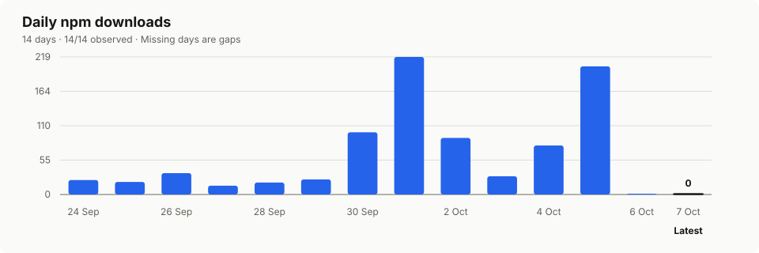
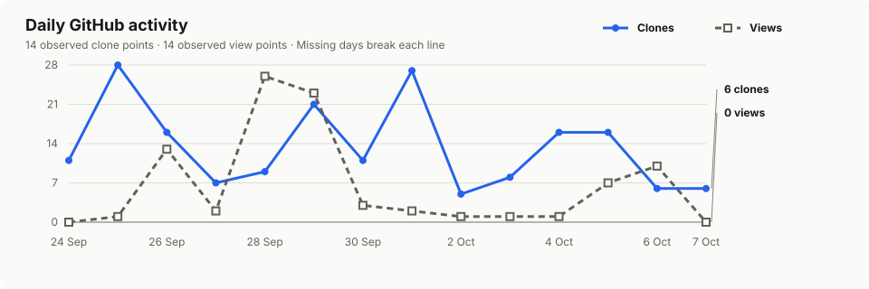
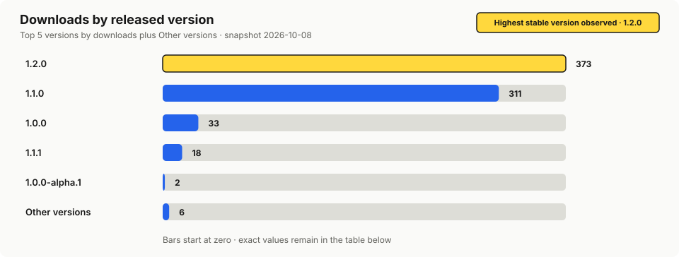

# SDK adoption overview

Generated from the `2026-10-08` snapshot at `2026-10-08T10:33:17.431Z`.

External-adoption baseline: `2026-09-21`. External public repository evidence is measured from this date onward.

| Raw npm downloads · 14 days | Raw unique cloners · GitHub window | Raw unique viewers · GitHub window | External public projects with usage evidence |
| ---: | ---: | ---: | ---: |
| **853** | **84** | **14** | **4** |

**Coverage:** 14/14 npm days observed (success); 56/56 GitHub daily values observed (views success, clones success); public evidence partial. GitHub windows: unique cloners `2026-10-08` (current snapshot), unique viewers `2026-10-08` (current snapshot).

> Active installations are not measured. Raw signals can include CI, caches, repeat downloads and internal activity. npm downloads, repository traffic and external public-code evidence are separate signals and must not be added together as a user count.

## Usage and trends

Charts are linked to their full-size local SVG. Their exact values and missing-data states remain available in the tables below.

### Daily npm downloads

### Daily GitHub activity

### Downloads by released version

## Drill-down

Missing values remain `—`; they are never converted to zero or joined across gaps.

### Daily npm downloads

Period: `2026-09-24` through `2026-10-07`. Source status: **success**.

| Date | Downloads | Status |
| --- | --- | --- |
| 2026-09-24 | 23 | observed |
| 2026-09-25 | 20 | observed |
| 2026-09-26 | 34 | observed |
| 2026-09-27 | 14 | observed |
| 2026-09-28 | 19 | observed |
| 2026-09-29 | 24 | observed |
| 2026-09-30 | 99 | observed |
| 2026-10-01 | 219 | observed |
| 2026-10-02 | 90 | observed |
| 2026-10-03 | 29 | observed |
| 2026-10-04 | 78 | observed |
| 2026-10-05 | 204 | observed |
| 2026-10-06 | 0 | observed |
| 2026-10-07 | 0 | observed |

### GitHub traffic by day

One row represents one calendar date. Rolling totals are intentionally kept out of this table. Source status: views **success**; clones **success**.

| Date | Views | Unique viewers | Clones | Unique cloners |
| --- | --- | --- | --- | --- |
| 2026-09-24 | 0 | 0 | 11 | 7 |
| 2026-09-25 | 1 | 1 | 28 | 19 |
| 2026-09-26 | 13 | 1 | 16 | 9 |
| 2026-09-27 | 2 | 2 | 7 | 3 |
| 2026-09-28 | 26 | 3 | 9 | 5 |
| 2026-09-29 | 23 | 3 | 21 | 12 |
| 2026-09-30 | 3 | 1 | 11 | 6 |
| 2026-10-01 | 2 | 2 | 27 | 16 |
| 2026-10-02 | 1 | 1 | 5 | 1 |
| 2026-10-03 | 1 | 1 | 8 | 3 |
| 2026-10-04 | 1 | 1 | 16 | 7 |
| 2026-10-05 | 7 | 3 | 16 | 8 |
| 2026-10-06 | 10 | 1 | 6 | 2 |
| 2026-10-07 | 0 | 0 | 6 | 2 |

### Current GitHub rolling window

Each value keeps its own observation date because GitHub's rolling endpoints can refresh independently. These are window totals, not additional daily observations.

| Metric | Observed | Freshness | Value | Status |
| --- | --- | --- | --- | --- |
| Views | 2026-10-08 | current snapshot | 90 | observed |
| Unique viewers | 2026-10-08 | current snapshot | 14 | observed |
| Clones | 2026-10-08 | current snapshot | 187 | observed |
| Unique cloners | 2026-10-08 | current snapshot | 84 | observed |

### npm version snapshot

Snapshot date: `2026-10-08` (current snapshot). This is npm's rolling version-level snapshot; it is separate from daily package downloads. Every exact version remains in this table even when the chart groups overflow.

| Version | Downloads | Status |
| --- | --- | --- |
| 1\.0\.0 | 33 | observed |
| 1\.0\.0-alpha\.1 | 2 | observed |
| 1\.0\.0-alpha\.2 | 2 | observed |
| 1\.0\.0-alpha\.3 | 2 | observed |
| 1\.0\.0-alpha\.4 | 2 | observed |
| 1\.1\.0 | 311 | observed |
| 1\.1\.1 | 18 | observed |
| 1\.2\.0 | 373 | observed |

### External public repository evidence

This index contains independently owned public repository identifiers and evidence URLs only. Public projects with usage evidence exclude repositories owned by `marcel-tuinstra` or `Tuinstra-DEV`. Archived and forked repositories remain visible but are excluded from the project count. Static active-use evidence is not runtime proof.

| Repository | State | Declared | Resolved | Evidence | Confidence | Counted |
| --- | --- | --- | --- | --- | --- | --- |
| bentley0098/fitness-app | active | ^1\.2\.0 | — | active\_use\_evidence, dependency\_declaration, sdk\_import | high | yes |
| bibixx/trenuj-se | active | ^1\.0\.0 | — | active\_use\_evidence, dependency\_declaration, sdk\_import | high | yes |
| cezarsmpio/apple-to-garmin | active | — | — | active\_use\_evidence, sdk\_import | high | yes |
| elfnattaphon/garmin-mcp | active | ^1\.0\.0 | — | active\_use\_evidence, dependency\_declaration, sdk\_import | high | yes |

<strong>Collection health and limitations</strong>

| Source | Status | HTTP | Reason |
| --- | --- | --- | --- |
| github\_public\_content | partial | — | — |
| github\_public\_metadata | success | — | — |
| github\_public\_search | partial | — | — |
| github\_public\_search\_query\_1 | success | — | — |
| github\_public\_search\_query\_2 | success | — | — |
| github\_public\_search\_query\_3 | success | — | — |
| github\_public\_search\_query\_4 | success | — | — |
| github\_public\_search\_query\_5 | success | — | — |
| github\_public\_search\_query\_6 | success | — | — |
| github\_traffic\_clones | success | — | — |
| github\_traffic\_views | success | — | — |
| npm\_downloads | success | — | — |
| npm\_versions | success | — | — |

- npm downloads can include caches, CI and repeat downloads.
- GitHub traffic is repository-level and its rolling history cannot be backfilled after the source window expires.
- GitHub public code search can be delayed, incomplete, rate-limited or truncated and does not include private or unindexed repositories.
- A dependency, lockfile, import or static callsite is evidence with a stated confidence level, not proof of a running installation or license violation.

